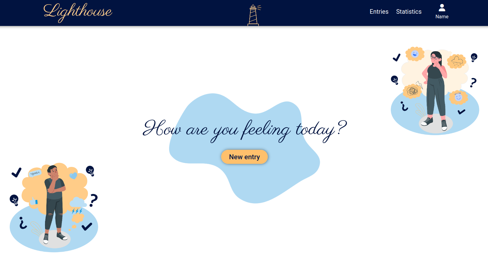
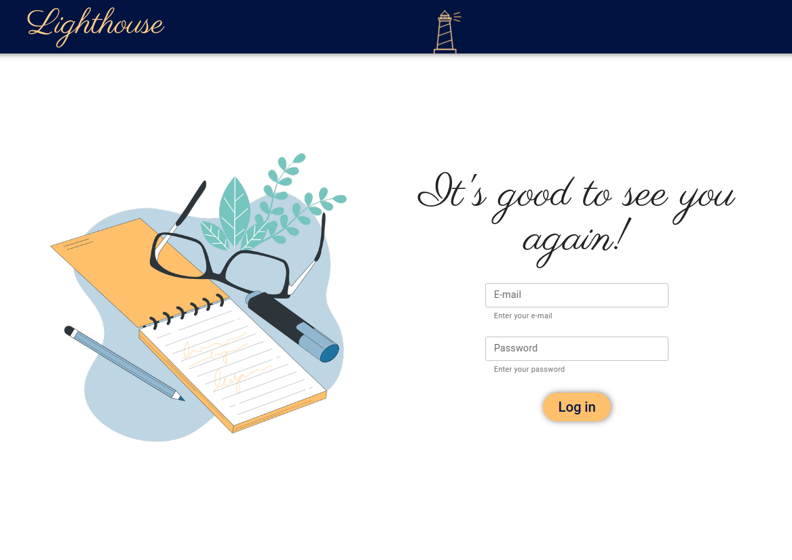
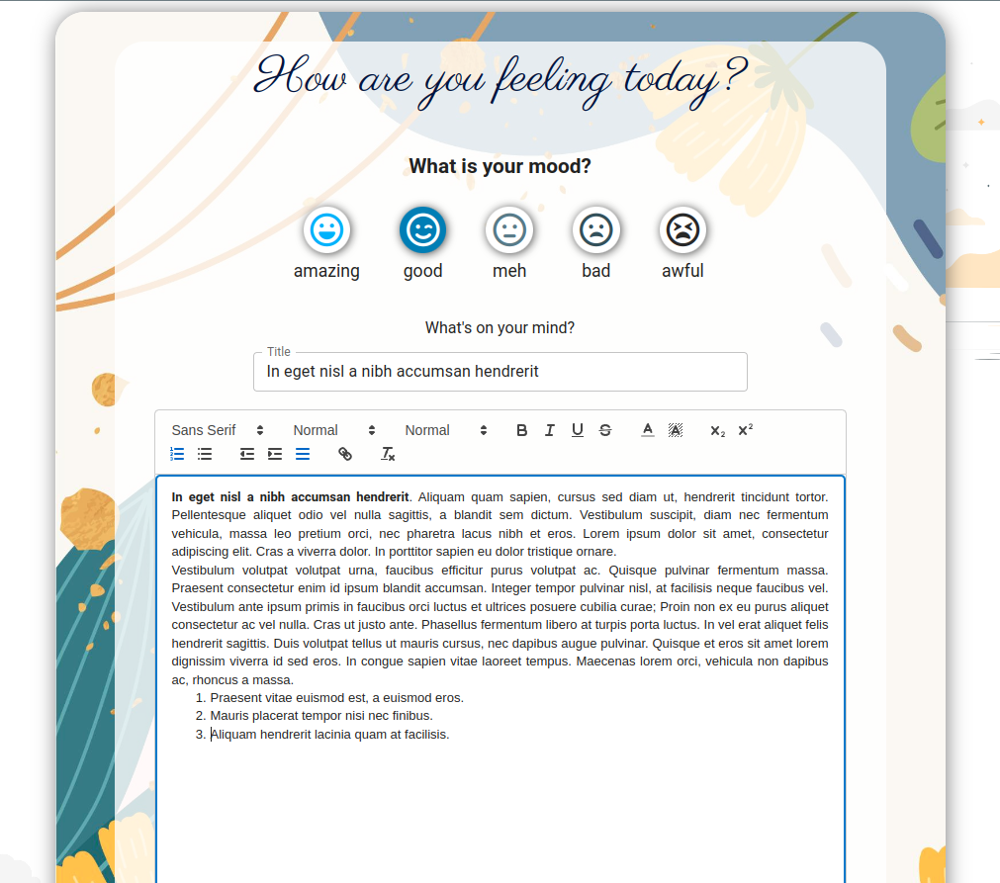
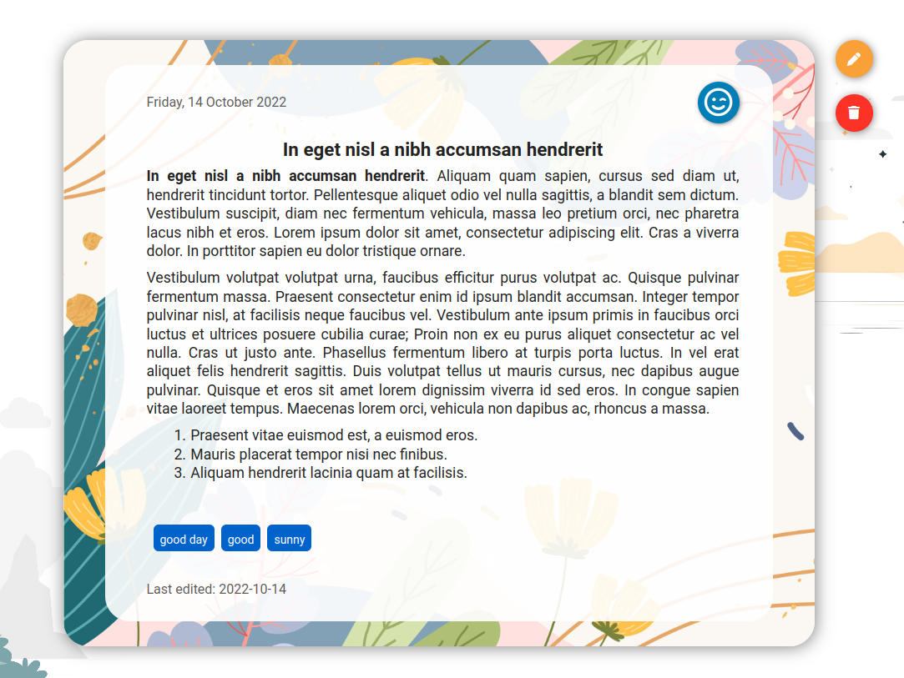
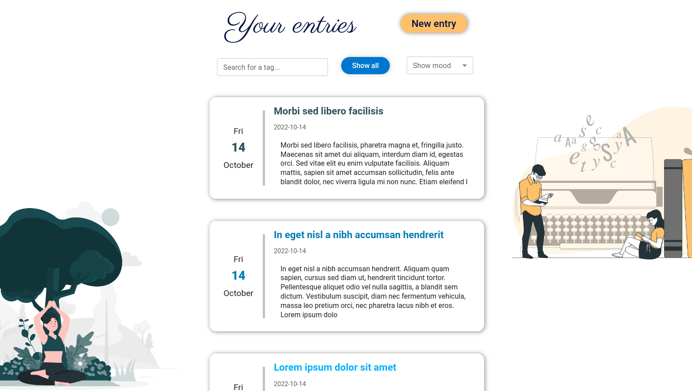
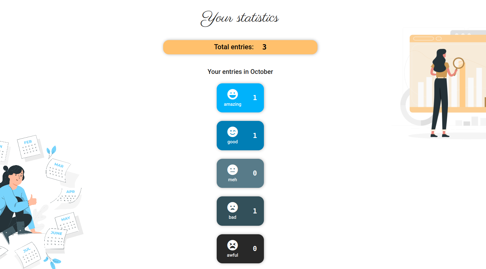

<h1 align="center">Welcome to Lighthouse 👋</h1>

  
  

***
## 📄 Project Description

[Lighthouse](https://lighthouse-journal.netlify.app/) is an online journal for intentional writing and mood tracking.
 

### Dashboard

  

### Features:
- create and manage personal account
  

  
- create entries and mark them with your mood and tags
  
 
  
- display your entries and sort by specific tags and mood
  

  
- see the total number of entries and your mood stats for current month
  

***
## Built With

  

- Design: Figma
- Language: JavaScript
- Framework: React
- FrontEnd: Sass + MUI
- Database: Supabase

***

## Acknowledgments
App illustrations by <a href="https://storyset.com/">Storyset</a>, <a href="https://delesign.com/free-resources">Delesign</a> and <a href="https://iradesign.io/">Iradesign</a>.

***
## Author

* Github: [@martaN7](https://github.com/martaN7)

## Show your support

Give a ⭐️ if this project helped you!

***
_This README was generated with ❤️ by [readme-md-generator](https://github.com/kefranabg/readme-md-generator)_